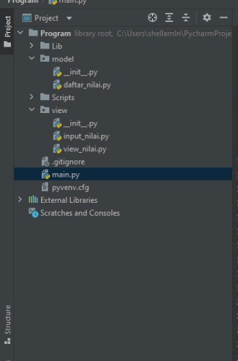
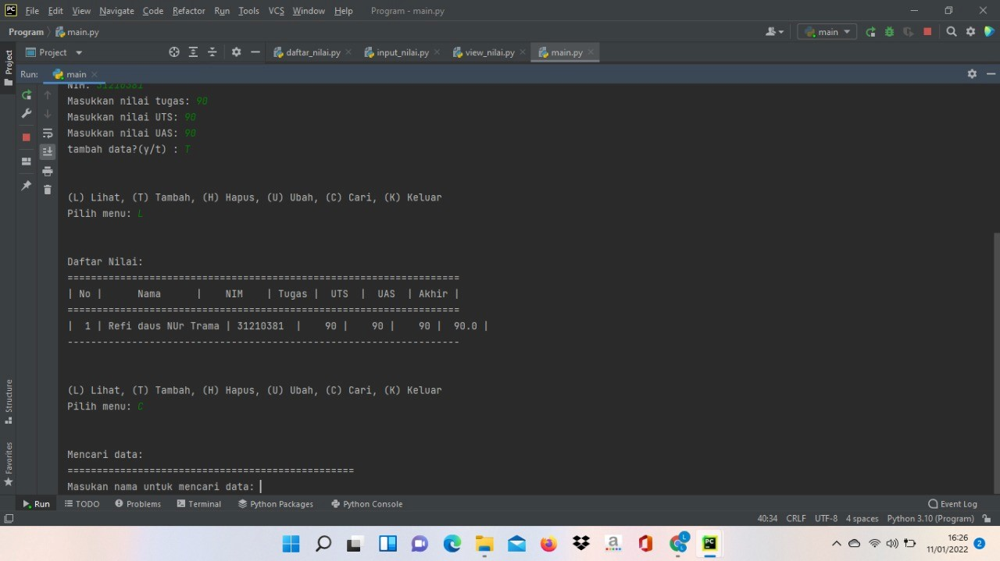
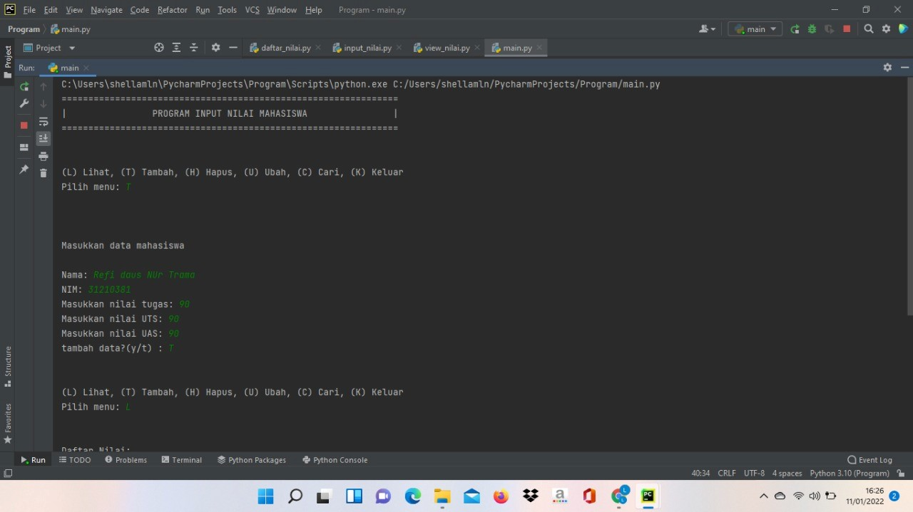

# UAS-SEMESTER1
##STRUKTUR MODUL  <p>
 <p>

DI BAWAH  INI ISI DARI FILE DAFTAR_NILAI.PY Berikut isi dari file tersebut:
```javascript
from view.input_nilai import *

data = {}

Menambahkan data

def tambah_data():
global data
ulangi = 'y'
while ulangi =='y':
nama = input_nama()
nim = input_nim()
nilai_tugas = input_ntugas()
nilai_uts = input_nuts()
nilai_uas = input_nuas()
nilai_akhir = nakhir()
data[nama] = [nama, nim, nilai_tugas, nilai_uts, nilai_uas, nilai_akhir]
ulangi = (input('tambah data?(y/t) : '))

        if ulangi == 't':
            print('\nData berhasil di tambah!')
            return data

Mengubah data

def ubah_data():
nama = input("Masukan nama untuk mengubah data: ")
if nama in data.keys():
print("\nMau mengubah apa?")
sub_data = input("(Semua), (NIM), (Tugas), (UTS), (UAS) : ")
if sub_data.lower() == "semua":
print("==========================")
print("Ubah data {}.".format(nama))
print("==========================")
data[nama][1] = input("Ubah NIM:")
data[nama][2] = int(input("Ubah Nilai Tugas: "))
data[nama][3] = int(input("Ubah Nilai UTS: "))
data[nama][4] = int(input("Ubah Nilai UAS: "))
data[nama][5] = data[nama][2] *30/100 + data[nama][3]*35/100 + data[nama][4] \*35/100
print("\nBerhasil ubah data!")

        elif sub_data.lower() == "nim":
            data[nama][1] = input("\nNIM:")
            print('\nData berhasil di ubah!')
        elif sub_data.lower() == "tugas":
            data[nama][2] = int(input("\nNilai Tugas: "))
            data[nama][5] = data[nama][2] *30/100 + data[nama][3]*35/100 + data[nama][4] *35/100
            print('\nData berhasil di ubah!')
        elif sub_data.lower() == "uts":
            data[nama][3] = int(input("\nNilai UTS: "))
            data[nama][5] = data[nama][2] *30/100 + data[nama][3]*35/100 + data[nama][4] *35/100
            print('\nData berhasil di ubah!')
        elif sub_data.lower() == "uas":
            data[nama][4] = int(input("\nNilai UAS: "))
            data[nama][5] = data[nama][2] *30/100 + data[nama][3]*35/100 + data[nama][4] *35/100
            print('\nData berhasil di ubah!')
        else:
            print("\nMenu tidak ditemukan.")

    else:
        print("'{}' Tidak ditemukan.".format(nama))

Menghapus data

def hapus_data():
nama = input("Masukan nama untuk menghapus data : ")
if nama in data.keys():
del data[nama]
print("\nData '{}' berhasil dihapus.".format(nama))
else:
print("'{}' Tidak ditemukan.".format(nama))

Mencari data
def cari_data():
print("Mencari data: ")
print("=================================================")
nama = input("Masukan nama untuk mencari data: ")
print('\nResult')
print("==============================================================")
print("| Nama | NIM | Tugas | UTS | UAS | Akhir |")
print("==============================================================")
if nama in data.keys():
print("| {0:14} | {1:9} | {2:5} | {3:5} | {4:5} | {5:5}"
.format(nama, data[nama][1], data[nama][2], data[nama][3], data[nama][4], data[nama][5]))
print('--------------------------------------------------------------')
else:
print("'{}' Tidak ditemukan.".format(nama))
```

DI BAWAH  INI ISI DARI FILE INPUT_NILAI.PYBerikut isi dari file tersebut :
```javascript
elif c.lower() == 'c':
        print("Cari Data[case-sensitive]")
        nama = input("Masukkan Nama : ")
        if nama in x.keys():
            print("="*73)
            print("|                             Daftar Mahasiswa                          |")
            print("="*73)
            print("| Nama            |       NIM       |  UTS  |  UAS  |  Tugas  |  Akhir  |")
            print("="*73)
            print("| {0:15s} | {1:15d} | {2:5d} | {3:5d} | {4:7d} | {5:7.2f} |"
                  .format(nama, nim, uts, uas, tugas, akhir))
            print("="*73)
        else:
            print("Nama {0} Tidak Ditemukan".format(nama))

    elif c.lower() == 'l':
        if x.items():
            print("="*78)
            print("|                               Daftar Mahasiswa                             |")
            print("="*78)
            print("|No. | Nama            |       NIM       |  UTS  |  UAS  |  Tugas  |  Akhir  |")
            print("="*78)
            i = 0
            for z in x.items():
                i += 1
                print("| {no:2d} | {0:15s} | {1:15d} | {2:5d} | {3:5d} | {4:7d} | {5:7.2f} |"
                      .format(z[0][:13], z[1][0], z[1][1], z[1][2], z[1][3], z[1][4], no=i))
            print("=" * 78)
        else:
            print("="*78)
            print("|                               Daftar Mahasiswa                             |")
            print("="*78)
            print("|No. | Nama            |       NIM       |  UTS  |  UAS  |  Tugas  |  Akhir  |")
            print("="*78)
            print("|                                TIDAK ADA DATA                              |")
            print("="*78)

    elif c. lower() == 'k':
        break
```


saya membuat file index atau file utamanya. Yang saya beri nama main.py. Berikut isi dari file tersebut :
```javascript
from model.daftar_nilai import *
from view.view_nilai import *

#Mulai
print("===============================================================")
print("|                PROGRAM INPUT NILAI MAHASISWA                |")
print("===============================================================")

while True:
    print("\n")
    menu = input("(L) Lihat, (T) Tambah, (H) Hapus, (U) Ubah, (C) Cari, (K) Keluar\nPilih menu: ")
    print("\n")

    # menu
    if menu.lower() == 't':
        tambah_data()

    elif menu.lower() == 'c':
        cari_data()

    elif menu.lower() == 'l':
        lihat_data()

    elif menu.lower() == 'u':
        ubah_data()

    elif menu.lower() == 'h':
        hapus_data()

    # Keluar
    elif menu.lower() == 'k':
        break

    else:
        print("Ada yang salah, Silahkan cek kembali.")
```
### HASIL OUTPUT :
 <p>
 <p>

